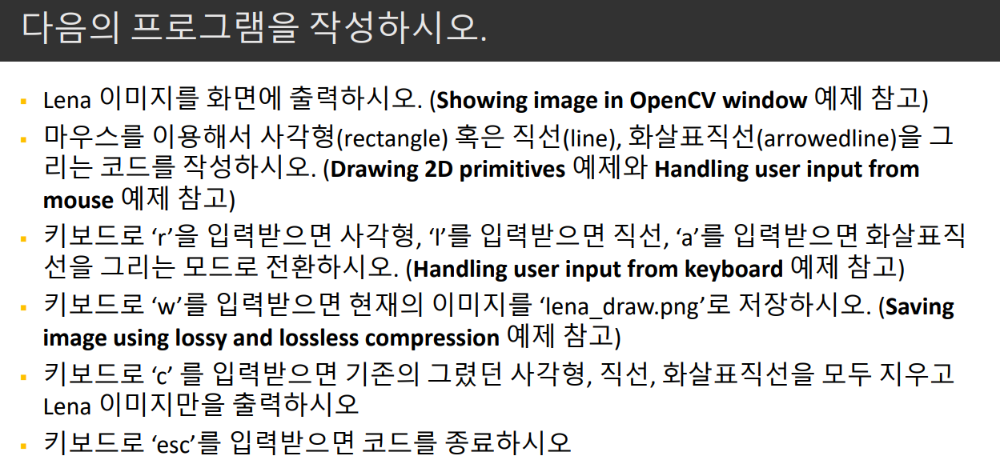

# 가상환경
* anaconda 설치하여 가상환경 생성
* 소스코드를 만들 때마다 거기에 맞는 환경 설정

# conda vs pip 차이점
* 받아오는 주소가 다르고 모듈과 패키지가 버전이 같더라고 다를 수 있다.
* pip는 특정 패키지만 설치한다. 
* conda는 특정 패키지를 위해 필요한 것을 같이 설치해준다.(엉킬 수 있다는 잠재적 위험이 존재한다)

# task
* task.py 파일에 구현완료

